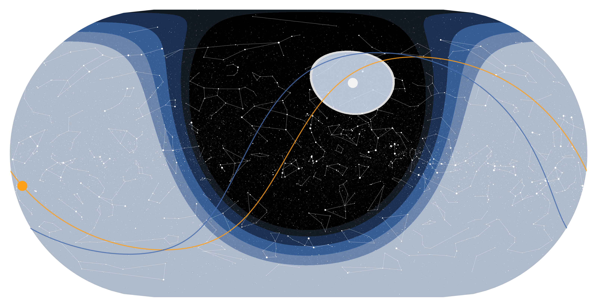

<p align="center">

</p>


**Skyshell** is a Python library for planning astronomical observations and displaying astronomical datasets on the night sky.

## Installation

To install Skyshell, download and extract the package and run `pip install .`. Alternatively, the two following lines of code do the same:

```
git clone https://github.com/curritod/skyshell
pip install ./skyshell
```

## Usage

The package consists of a single function that will create and return a matplotlib Figure that can be tweaked. Here is a minimal working example:

```python
from skyshell.skyplot import get_sky_plot
from astropy.time import Time

#For the current time
time = Time("2026-05-28 06:00:00", scale="utc")
fig, ax = get_sky_plot(time)
fig.savefig(f'default_example.png', bbox_inches='tight')

```

This will output the following figure:

<p align="center">

</p>

The function can be called with a number of arguments that will tweak how the figure is generated:

```python
import astropy.units as u
from astropy.time import Time
from astropy.coordinates import EarthLocation
from skyshell.skyplot import get_sky_plot

time = Time("2026-05-28 06:00:00", scale="utc")
location = EarthLocation(lat=-24.6272*u.deg, lon=-70.4042*u.deg, height=2635*u.m)

#For the current time
fig, ax = get_sky_plot(
    observation_time    = time,
    central_longitude   = 0.0, 
    central_latitude    = 0.0,
    plot_hipparcos      = True,
    plot_constellations = True,
    plot_ecliptic       = True,
    plot_equator        = True,
    plot_sun            = True,
    plot_moon           = True,
    plot_daylight       = True,
    plot_moonlight      = False,
    plot_horizon        = False,  
    projection          = 'eckert',
    azimuth             = 0.0,
    location            = location  
    )
    
fig.savefig(f'output.png', bbox_inches='tight')
```
You can find a ready to run script in the `/example` folder.